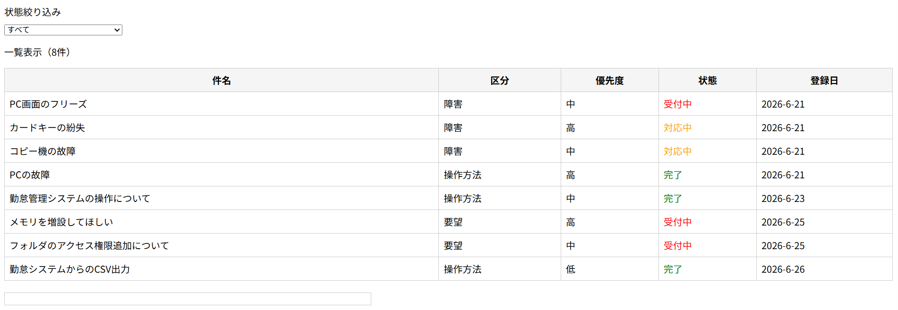
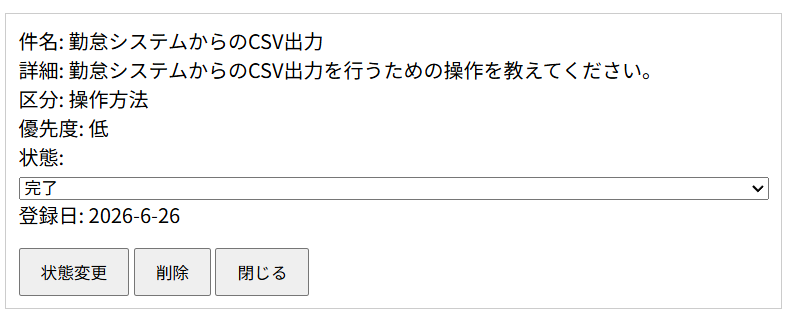
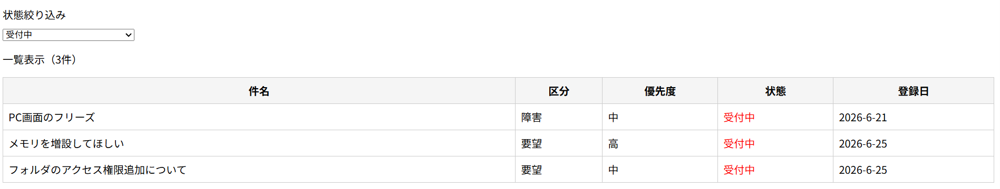

# 問い合わせ管理システム

## 概要

問い合わせ情報を管理するためのWebアプリケーションです。

問い合わせの登録、一覧表示、状態変更、削除を行うことができます。

JavaScriptの学習のために、CRUD（Create、Read、Update、Delete）の基本機能を実装しました。  

### 問い合わせ登録フォーム画面

### 問い合わせ一覧画面

### 詳細画面（状態変更・削除）

### 状態絞り込み画面

## 使用技術
- HTML
- CSS
- JavaScript
- LocalStorage  

## 実装機能
## 問い合わせ登録
- 件名
- 詳細
- 区分
- 優先度

を入力して問い合わせを登録できます。  

## 一覧表示

登録済みの問い合わせを一覧表示します。  

## 状態絞り込み  

以下の状態で絞り込みできます。

- 受付中
- 対応中
- 完了

## 詳細表示  

件名をクリックすると詳細情報を表示できます。

## 状態変更  

詳細画面から状態を変更できます。

## 削除  

確認ダイアログ表示後に問い合わせを削除できます。

## データ保存  

LocalStorageを利用し、ブラウザを再読み込みしてもデータを保持します。  

## 工夫した点
- 状態による色分け表示
- 件数表示機能
- 状態絞り込み機能
- LocalStorageによるデータ永続化
- 確認ダイアログ付き削除機能
- 詳細画面からの状態変更  

## 今後の改善案  

- 編集機能の追加
- ソート機能の追加
- データ件数増加時のページング機能
- バックエンドとの連携
- データベース保存対応  

## 学習したこと

このアプリの開発を通じて以下を学習しました。

- DOM操作
- イベント処理
- 配列のfilter()
- 配列のfind()
- LocalStorage
- CRUD処理の基本設計
- CSSによるレイアウト調整
